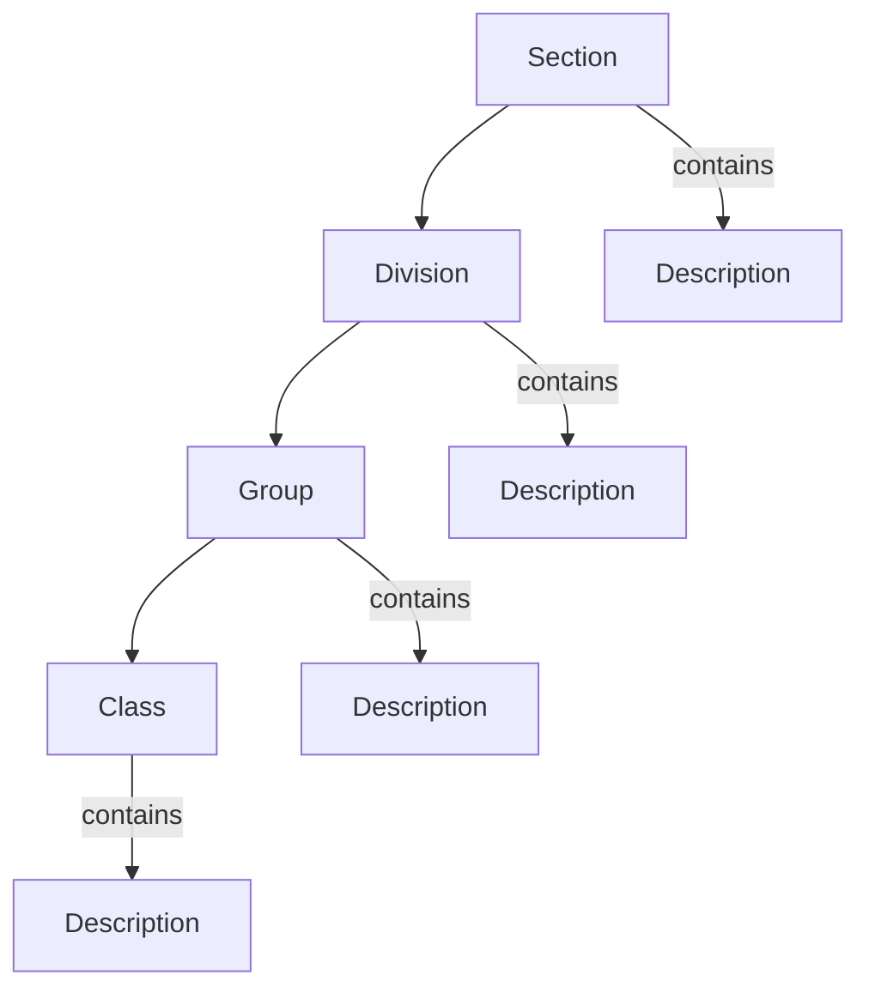

# ISIC4Kit

<p align="center">
  
</p>


ISIC4Kit is a Python library for working with the International Standard Industrial Classification of All Economic Activities (ISIC), Revision 4. It provides an easy way to navigate and search through the ISIC hierarchical structure in multiple languages.

## Structure

ISIC follows a hierarchical structure:



Each level contains:
- **Section**: Highest level (A-U), e.g., "A" for Agriculture
- **Division**: Two-digit code (01-99)
- **Group**: Three-digit code (011-999)
- **Class**: Four-digit code (0111-9999)

## Installation

```bash
pip install isic4kit
```

## Usage

### Basic Usage

```python
from isic4kit import ISIC4Classifier

# Initialize classifier (English)
isic = ISIC4Classifier(language="en")

# Get a section
section = isic.get_section("a")
section.print_tree()
```

Output:
```
└── a: Agriculture, forestry and fishing
    ├── 01: Crop and animal production, hunting and related service activities
    │   ├── 011: Growing of non-perennial crops
    │   │   ├── 0111: Growing of cereals (except rice), leguminous crops and oil seeds
    │   │   ├── 0112: Growing of rice
    │   │   └── ...
    │   └── ...
    └── ...
```

```python
# Get a specific division
division = isic.get_division("01")
division.print_tree()
```

Output:
```
└── 01: Crop and animal production, hunting and related service activities
    ├── 011: Growing of non-perennial crops
    │   ├── 0111: Growing of cereals (except rice), leguminous crops and oil seeds
    │   ├── 0112: Growing of rice
    │   └── ...
    └── ...
```

### Search Functionality

```python
# Search for activities
results = isic.search("mining")
results.print_tree()
```

Output:
```
├── 05: Mining of coal and lignite
│   ├── 051: Mining of hard coal
│   │   └── 0510: Mining of hard coal (anthracite)
│   └── 052: Mining of lignite
│       └── 0520: Mining of lignite
├── 07: Mining of metal ores
│   ├── 071: Mining of iron ores
│   │   └── 0710: Mining of iron ores
│   └── ...
└── ...
```

### Multi-language Support

The classifier supports multiple languages. Here's an example in Arabic:

```python
# Initialize classifier (Arabic)
isic_ar = ISIC4Classifier(language="ar")

# Get a section in Arabic
section = isic_ar.get_section("a")
section.print_tree()
```

Output:
```
└── أ: الزراعة والحراجة وصيد الأسماك
    ├── 01: أنشطة زراعة المحاصيل والإنتاج الحيواني والصيد والخدمات المتصلة
    │   ├── 011: زراعة المحاصيل غير الدائمة
    │   │   ├── 0111: زراعة الحبوب (باستثناء الأرز) والمحاصيل البقولية والبذور الزيتية
    │   │   ├── 0112: زراعة الأرز
    │   │   └── ...
    │   └── ...
    └── ...
```

```python
# Search in Arabic
results = isic_ar.search("تعدين")
results.print_tree()
```

Output:
```
├── 05: تعدين الفحم والليغنيت
    ├── 051: تعدين الفحم القاسي
    │   └── 0510: تعدين الفحم القاسي (الأنفراثيت)
    ├── 052: تعدين الليغنيت
    │   └── 0520: تعدين الليغنيت
    └── ...
├── 07: تعدين ركازات الفلزات
    ├── 071: تعدين ركازات الحديد
    │   └── 0710: تعدين ركازات الحديد
    └── ...
└── ...
```

## Supported Languages

- English (en)
- Arabic (ar)
- More languages coming soon...

## Data Structure

The ISIC data is organized in a hierarchical structure:

```python
sections = [
    {
        "section": "A",
        "description": "Agriculture, forestry and fishing",
        "divisions": [
            {
                "division": "01",
                "description": "Crop and animal production",
                "groups": [
                    {
                        "group": "011",
                        "description": "Growing of non-perennial crops",
                        "classes": [
                            {
                                "class": "0111",
                                "description": "Growing of cereals"
                            },
                            # ...
                        ]
                    },
                    # ...
                ]
            },
            # ...
        ]
    },
    # ...
]
```


## Contributing

Contributions are welcome! Please feel free to submit a Pull Request.

## Contributors

- [Abdullah Alqahtani](https://github.com/anqorithm)


## License

[MIT License](LICENSE)