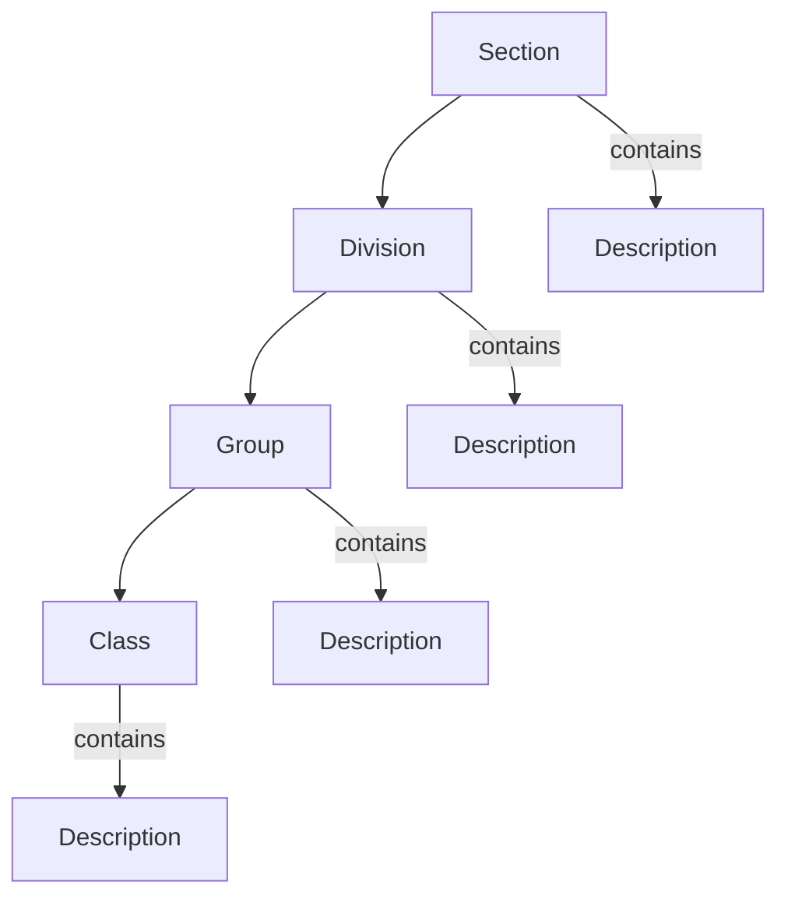

# ISIC4Kit

ISIC4Kit is a Python library for working with the International Standard Industrial Classification of All Economic Activities (ISIC), Revision 4. It provides an easy way to navigate and search through the ISIC hierarchical structure in multiple languages.

## Structure

ISIC follows a hierarchical structure:



Each level contains:
- **Section**: Highest level (A-U), e.g., "A" for Agriculture
- **Division**: Two-digit code (01-99)
- **Group**: Three-digit code (011-999)
- **Class**: Four-digit code (0111-9999)

## Installation

```bash
pip install isic4kit
```

## Usage

### Basic Usage

```python
from isic4kit import ISIC4Classifier

# Initialize classifier (English)
isic = ISIC4Classifier(language="en")

# Get a section
section = isic.get_section("a")
section.print_tree()

# Get a division
division = isic.get_division("01")
division.print_tree()

# Get a group
group = isic.get_group("011")
group.print_tree()

# Get a class
class_ = isic.get_class("0111")
class_.print_tree()

# Search
results = isic.search("mining")
results.print_tree()
```

### Multi-language Support

The classifier supports multiple languages. Here's an example in Arabic:

```python
# Initialize classifier (Arabic)
isic_ar = ISIC4Classifier(language="ar")

# Get a section in Arabic
section = isic_ar.get_section("a")
section.print_tree()

# Search in Arabic
results = isic_ar.search("تعدين")
results.print_tree()
```

## Supported Languages

- English (en)
- Arabic (ar)
- More languages coming soon...

## Data Structure

The ISIC data is organized in a hierarchical structure:

```python
sections = [
    {
        "section": "A",
        "description": "Agriculture, forestry and fishing",
        "divisions": [
            {
                "division": "01",
                "description": "Crop and animal production",
                "groups": [
                    {
                        "group": "011",
                        "description": "Growing of non-perennial crops",
                        "classes": [
                            {
                                "class": "0111",
                                "description": "Growing of cereals"
                            },
                            # ...
                        ]
                    },
                    # ...
                ]
            },
            # ...
        ]
    },
    # ...
]
```

## License

[MIT License](LICENSE)

## Contributing

Contributions are welcome! Please feel free to submit a Pull Request.